# Database Manager

## Purpose

The Database Manager repo is an internal tool to better manage the state of projects, skills and dev-logs on [HasinZaman.link](http://hasinzaman.link).

Before the creation of this tool - the database tool in use has become inefficient, slow process and increasingly obtuse to use. The main issues can be categorized into three groups:

 1. Excessive Operations

The current database tool requires a hard reset, followed by reconstructing the database from scratch - to update the database. This was quite useful during the early development of the database. As, the low tuple count and frequent schema updates - meant it was more convenient to do a hard reset and reconstruction. Compared to updating/editing/adding/deleting a limited number of tuples or updating tuples to abide by an updated schema.

However, as the schema becomes more stable and the number of tuples in relations balloon. The current database tool is excessively slow and not scalable.

Rather than fully destroying and reconstructing the database - the new database manager would add, edit, and delete tuples, without the full reconstruction of the database. The new database manager would only reconstruct the database from scratch when schemas are changed. Since the schema has become more stable - the need for hard resets has become increasingly rare.

 2. Hard to View Database State

The current database tool cannot view the state of the Database. As a result, it is required to use a slow online database tool(MyPHPAdmin) provided by the database provider. Since the current database is structured to be similar to a graph of tags. It is quite difficult to see the relationship between tags in a relational database. This is why the new database should provide a couple of viewing options to better conceptualize the database.

Firstly, the new tool should be able to easily show the relationship between schema. For instance, the colour highlighting of primary and foreign keys.

Secondly, the new tool should easily filter tags by type, name and relationships. For instance, this would be useful in conceptualizing the relationship between a project and skills; the link of dev-logs; or even the similarity of skills (ex. the relationship between Web-Dev & HTML, CSS, JS, TS, etc.).

 3. Difficult to Execute Long and Single SQL Commands

The Current database tool sends commands by reading each line of a text file - in which, each line is an SQL command. This has the advantage of storing numerous commands in sequence in a single file.

However, this input system breaks down as longer and more complicated commands. For instance, the implementation of a dev-log would require multi-line command parsing - as the alternative to putting entire dev-logs in one line. Not to mention, queries with sub-queries are easier to read and debug when formatted on multiple lines. This is why the new database tool needs to parse multi-line commands and long input attributes.

This input system also is excessive for short SQL commands. For instance, an impromptu "SELECT * FROM Relation" call - takes too long to execute. As the command needs to be put in a text file, saved, then opened by the database tool and then executed. The process can be sped up - if the database tool can receive SQL commands in the command prompt on run time.

## UI
|  |
|:--:|
| Fig.1.1 Database Manager UI State Diagram |

### Schema UI Concept
| 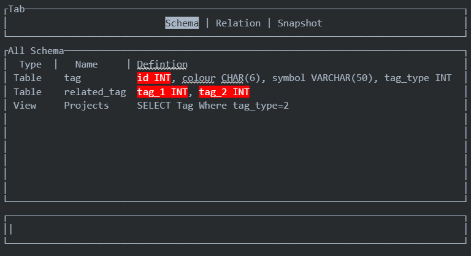 |
|:--:|
| Fig.1.2.1 Schema UI |

| 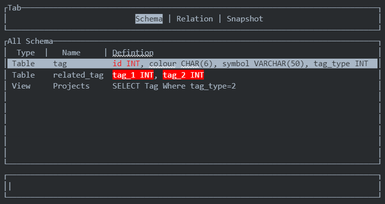 |
|:--:|
| Fig.1.2.2 Schema UI |

| 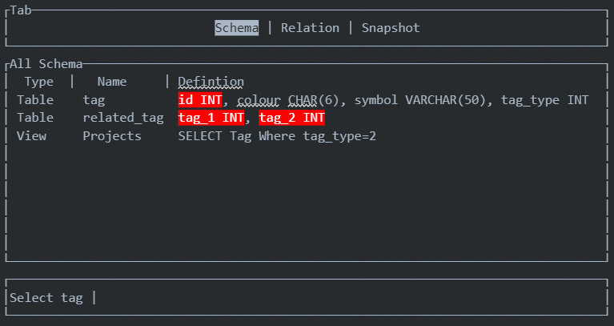 |
|:--:|
| Fig.1.2.3 Schema UI |

| 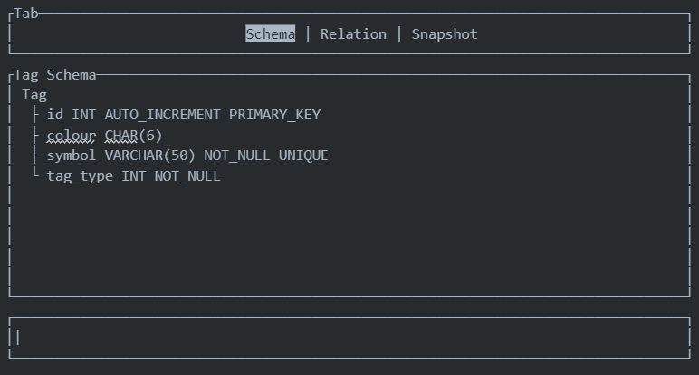 |
|:--:|
| Fig.1.2.4 Schema UI |

|  |
|:--:|
| Fig.1.2.5 Schema UI |

| 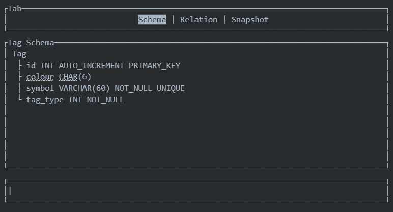 |
|:--:|
| Fig.1.2.6 Schema UI |

| 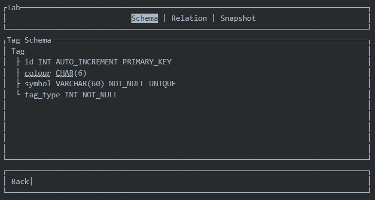 |
|:--:|
| Fig.1.2.7 Schema UI |

| 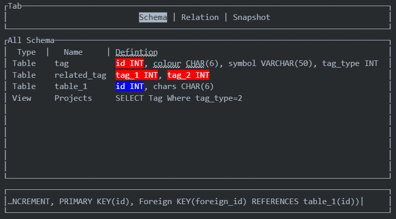 |
|:--:|
| Fig.1.2.8 Schema UI |

| 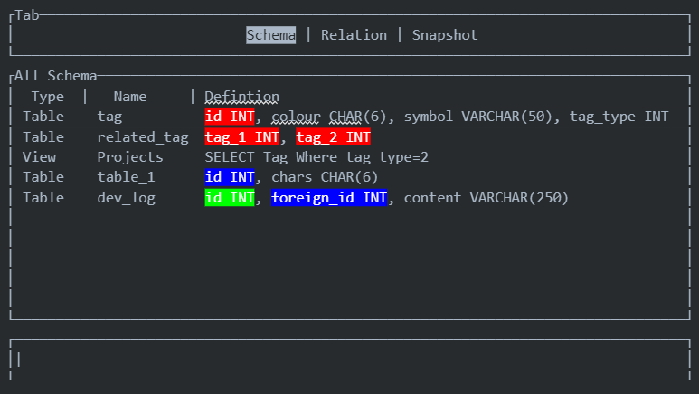 |
|:--:|
| Fig.1.2.9 Schema UI |

### Relation UI Concept
| 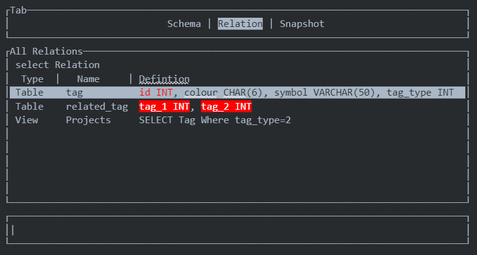 |
|:--:|
| Fig.1.3.1 Relation UI |

| 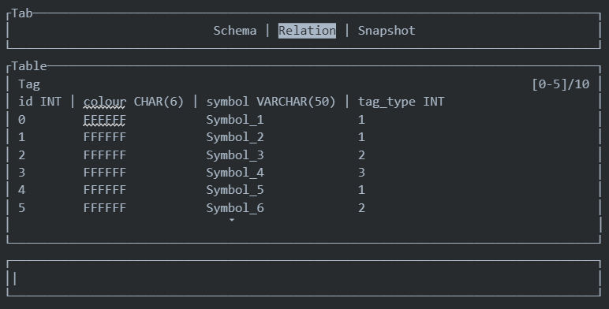 |
|:--:|
| Fig.1.3.2 Relation UI |

| 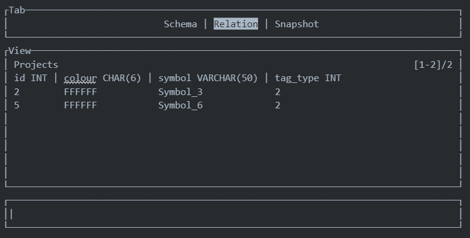 |
|:--:|
| Fig.1.3.3 Relation UI |

### Snapshot UI Concept
|  |
|:--:|
| Fig.1.4.1 Snapshot UI |

|  |
|:--:|
| Fig.1.4.2 Snapshot UI |

|  |
|:--:|
| Fig.1.4.3 Snapshot UI |

|  |
|:--:|
| Fig.1.4.4 Snapshot UI |

|  |
|:--:|
| Fig.1.4.5 Snapshot UI |

## Testing

In order to better understand the capabilities of the new database manager tool. It will be tested in a couple of ways. Firstly, the the current schema will be updated to a newer schema using the new database manager. Secondly, new tuples would be added to each relation to using numerous different input methods (input attr from raw text from console, input attr from file from console, input command from file). Finally, tests will be done on the speed and usability of saving and resetting the database to a snapshot.

### Current Database
|  |
|:--:|
| Fig.2.1 Current Database Entity Diagram |

|  |
|:--:|
| Fig.2.2 Current Database Schema Diagram |

### New Database
| 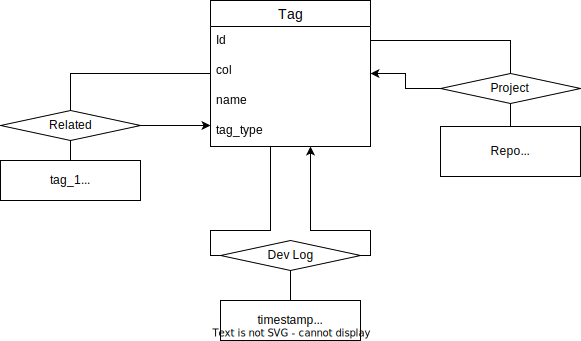 |
|:--:|
| Fig.3.1 New Proposed Database Entity Diagram |

|  |
|:--:|
| Fig.3.2 New Proposed Database Schema Diagram |